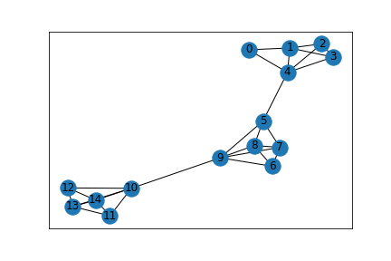

# Simulate Communication Networks with NS-3

## Description
This project is a tool to simulate any given network topology with [NS-3](https://www.nsnam.org). [NS3](https://www.nsnam.org) is free software, oftenly used in industry to simulate networks with different topologies, traffic, etc. This project includes a Python Jupyter Notebook to construct a network graph. A config file is generated based on the network graph. NS-3 C++ file parses the config file, generated the given network, simulate TCP traffic, and outputs throughput for each node to terminal.

## Dependencies

* numpy
* matplotlib
* networkx
* ns3

## Usage

* Use `./python/gen.ipynb` notebook to generate config files
* Config files (`.cfg`) are saved in `./config_files/` folder
* Pictures of generated network are saved in `./graphs/` folder
* Copy or move the `main.cc` to `scratch` directory of ns-3
* Change `config_filepath` in `main.cc` so ns-3 can reference the config file appropriately
* Run ns-3 by `./waf --run scratch/main`

## Example
Here is an example of a topology that is generated by the current code in python notebook:

## TODO
